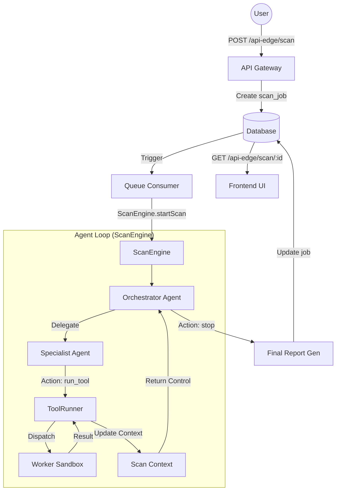

# Shipout AI Security Investigator: 5-Agent Architecture

This document outlines the step-by-step flow and responsibilities of the 5-agent system in Shipout.

## System Overview

Shipout utilizes an **Adaptive Agent Loop** (`observe` → [decide](./agents/orchestrator-agent.ts#L17-L61) → `act` → `update`) to perform security audits. The system is controlled by the [ScanEngine](./engine/scan-engine.ts#L9-L105), which orchestrates the interaction between a high-level [OrchestratorAgent](./agents/orchestrator-agent.ts#L5-L62) (powered by Gemini) and multiple deterministic specialist agents.

## The 5 Agents

| Agent | Responsibility | Key Tools |
| :--- | :--- | :--- |
| **Orchestrator** | Team leader; plans the scan, chooses specialists, evaluates coverage, and generates the final report. | Gemini LLM |
| **Recon** | Scout; discovers the attack surface (pages, endpoints, tech stack). | `http_probe`, `endpoint_discovery` |
| **Web Security** | Infrastructure expert; analyzes HTTP security, CORS, cookies, and rate limits. | `header_analysis`, `cors_test`, `rate_limit_test` |
| **Secrets** | Leak detector; scans for API keys and credentials in code and environment files. | `javascript_secret_scan` |
| **Dependency** | Supply chain auditor; checks for known CVEs in the project's dependency tree. | `dependency_cve_lookup` |

## Detailed Control Flow

## Step-by-Step Walkthrough

1.  **Scan Start**: User initiates a scan via the Audit UI.
2.  **Job Creation**: API creates a `scan_job` in Supabase.
3.  **Queue Pickup**: Queue consumer triggers `ScanEngine.startScan(job)`.
4.  **Loop Initialization**: [ScanEngine](./engine/scan-engine.ts#L9-L105) creates the [ScanContext](./shared/types/scan-context.ts#L34-L60) and registers the specialists with the [AgentPlanner](./services/agent-planner/index.ts#L5-L108).
5.  **Orchestrator Decision**: The [OrchestratorAgent](./agents/orchestrator-agent.ts#L5-L62) (Gemini) looks at the current context (initially empty) and decides to delegate to [ReconAgent](./agents/recon-agent.ts#L4-L41).
6.  **Recon Execution**: [ReconAgent](./agents/recon-agent.ts#L4-L41) runs `http_probe` and `endpoint_discovery` via [ToolRunner](./services/tool-runner/index.ts#L4-L114).
7.  **Context Update**: Workers return findings; [ScanContext](./shared/types/scan-context.ts#L34-L60) is updated with discovered pages/endpoints.
8.  **Specialist Chain**: The Orchestrator sees endpoints and delegates to [WebSecurityAgent](./agents/web-security-agent.ts#L4-L57) for header analysis, or [SecretsAgent](./agents/secrets-agent.ts#L4-L29) if JS bundles were found.
9.  **Budget & Coverage**: The loop continues until the Orchestrator determines coverage is sufficient or the [ScanBudget](./shared/types/scan-context.ts#L10-L15) (max tools/time) is exhausted.
10. **Final Report**: Orchestrator generates a summarized security finding (leveraging Gemini for natural language explanations).
11. **Completion**: [ScanEngine](./engine/scan-engine.ts#L9-L105) saves the final results and score to the database.
